  <!-- Banner -->
  

  

  <!-- Typing Subtitle -->
  

   

  <!-- Motto -->

<code>// Simplifying complexity through thoughtful code and clean interface design.</code>

  

  <!-- Social Badges -->
  

    
    
    
    
  

  <!-- Visitor Counter -->
  

 

 

### 🛠️ Tech Stack & Toolkit

#### 🚀 Frameworks & Libraries

#### ⚙️ Backend & Systems

#### 🎨 Design & Productivity

 

 

### 📊 GitHub Analytics

  
  

  

